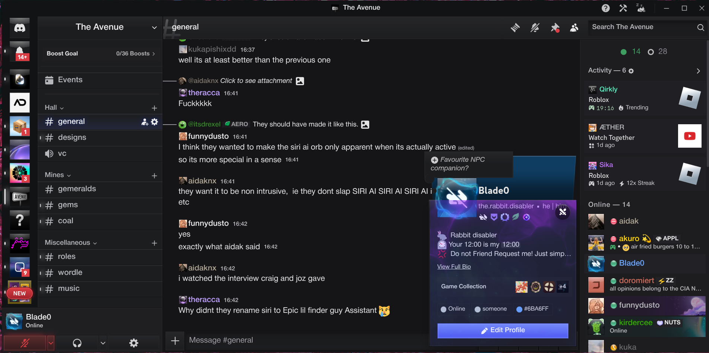

# Aider



the 700th skeuo theme

## build

this theme uses a dev script to check for changes in the source css files and combine them into a build file. to run locally:

1. clone the repository.
2. run `npm i`.
3. create a `.env` file in the project root with the paths of any local theme files you want to update (comma separated)

```sh
DEV_OUTPUT_PATH=/home/<USER>/.config/Vencord/themes/aider-dev.theme.css
```

4. run `npm run dev`.
5. make changes to any file in `/src` or the main theme file. the local theme files you listed will automatically be updated, along with the build file in `/build`.


## contributing

a few things to know when contributing:
1. any changes to the source css files should be made in the `/src` directory. **do not** make changes to the build file in `/build`.
2. circular elements should be avoided/used sparingly, only in small pieces (e.g statuses, tags, pings). If its in any way bigger than a ping, keep it square. 
3. Keep costly effects such as filters to a minimum, if you do use them, contain their paint zones with `contain: paint;`
4. Aider is a homage to old skeuomorphic design. You don't have to design in Discord's style, but it's a good starting point. (+ the more layout changes we make, the closer we get to the lag sun so uh)

## thanks

**Aidak** - design inspo, orginal person who wanted me to make a theme in this style

**refact0r** - base for compartmentalization of the theme, thank you for making mine life easier
